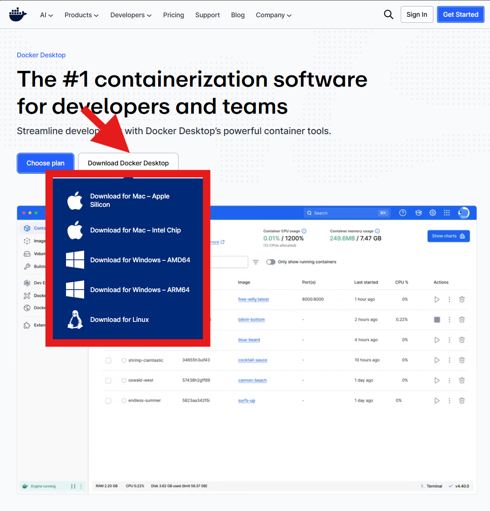
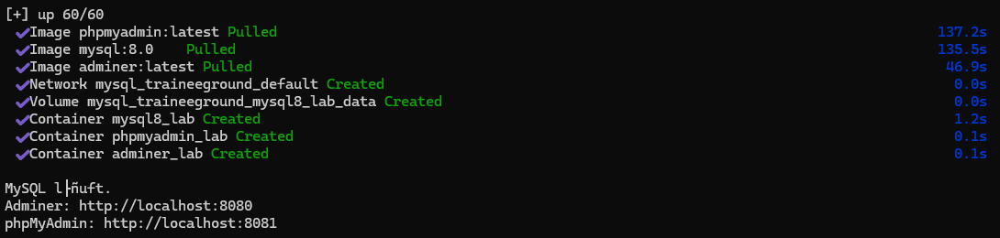

# MySQL_TraineeGround

## Dependencies

(1) [Docker Desktop installieren](https://www.docker.com/products/docker-desktop/)

(2) sich in Docker registrieren / einloggen

## Starten (CMD)

(1) Docker Desktop starten
(2) In ordnerroot doppelklick auf start.bat

(3) Danach hast du:
    - MySQL auf localhost:3306
    - Adminer im Browser auf http://localhost:8080
    - phpMyAdmin optional auf http://localhost:8081

## “Reiner Editor” im Browser (mit Tabellen-Ansicht + Output)

Adminer Login

Öffne http://localhost:8080 und nutze:

System: MySQL

Server: mysql (wichtig: im Docker-Netz heißt der Service so)

Benutzer: root

Passwort: root

Datenbank: bank

Dann hast du links Tabellen, oben SQL-Eingabe, unten Ergebnis/Tabellen.

Falls du Adminer vom Host verbinden willst (manchmal bietet Adminer Server-Feld): mysql ist korrekt innerhalb des Docker-Netzes. In vielen Fällen klappt auch localhost, aber zuverlässig ist mysql.

## MySQL Workbench anbinden (GUI-Client)

In MySQL Workbench:

+ (New Connection)

Connection Name: mysql8_lab

Hostname: 127.0.0.1

Port: 3306

Username: root

Password: root (Store in Vault)

Test Connection → OK.

Hinweis: 127.0.0.1 ist hier besser als localhost (manchmal DNS/Socket-Themen).
